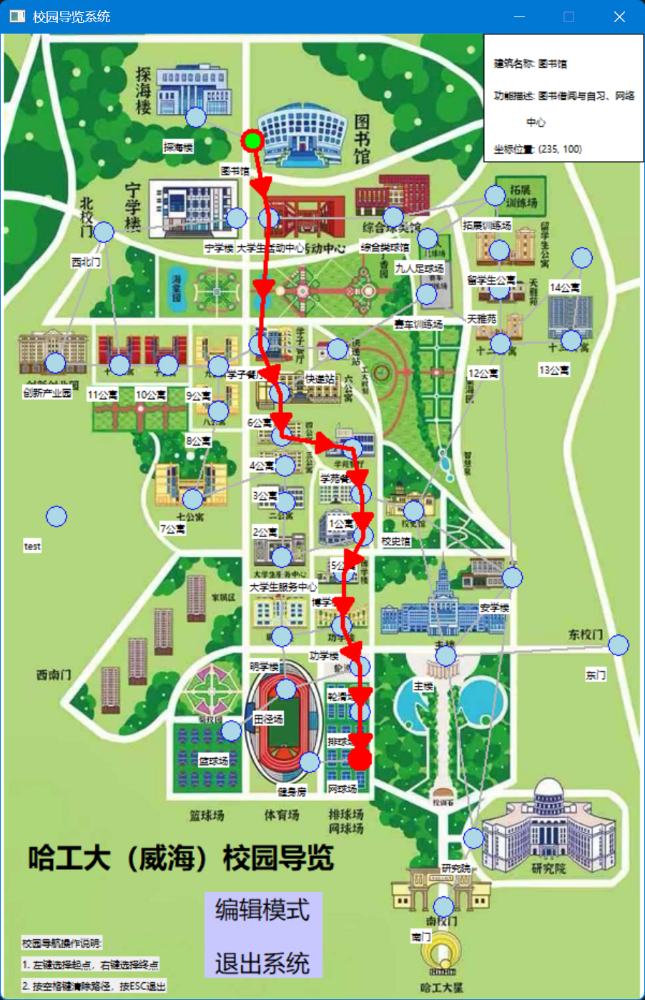

# 哈尔滨工业大学（威海）校园导览与管理系统

## 项目概述

本项目是一个基于 C++ 原生 Win32 API 开发的 Windows 桌面端图形化应用 。系统以哈尔滨工业大学（威海）校园为背景，实现了一套可视化的校园地图导航与拓扑数据管理工具。该项目展示了对底层图形渲染接口的调用能力以及对复杂数据结构与图算法的落地应用，适合作为“计算机科学与工程设计实践”等课程的结课项目或工程能力展示 。

## 核心功能

* **图形化最短路径规划**：系统加载校园实景平面图，用户可在地图上直观地点选起点与终点。底层基于 Dijkstra 算法计算最短路径，并在图层上使用带有方向箭头的红色轨迹进行高亮绘制。
* **拓扑结构动态编辑**：系统内置开发者视角的地图编辑器。在编辑模式下，支持通过鼠标右键拖拽实时修改建筑物节点坐标，并支持通过键盘指令动态添加或删除节点间的连线边。
* 
**节点信息交互**：提供实时状态显示面板。选中特定建筑节点后，侧边栏会实时呈现该建筑的详细元数据，例如建筑名称、功能定位（如“主楼：教务处、教师办公室”或“图书馆：图书借阅与自习、网络中心”）及当前逻辑坐标 。

* 
**本地数据持久化**：采用自定义的文本存储方案。系统将建筑物的实体状态数据序列化保存至 `campus_data.txt` ，将节点间的无向边拓扑关系保存至 `campus_edges.txt` 。地图编辑模式下的所有修改均会实时落盘，确保重新启动后数据状态一致。

## 技术架构与实现细节

* 
**底层框架**：脱离现代庞大的 UI 框架，直接采用纯 C++ 与 Win32 消息循环机制构建基础窗口 。利用 GDI (Graphics Device Interface) 进行双缓冲绘图、位图缩放渲染及几何图形绘制。

* **数据结构**：
* **邻接表 (Adjacency List)**：图的物理存储结构采用动态分配的邻接表，相较于邻接矩阵，大幅优化了稀疏图场景下的内存占用。
* **哈希表 (Hash Table)**：为了实现建筑物 ID 到具体内存数据的 O(1) 快速反查，自行实现了一套带冲突链表处理的哈希映射结构。

* **核心算法**：在路径搜索模块完整实现了基于权重（欧几里得距离）的 Dijkstra 算法，并配套实现了前驱节点数组以回溯输出完整的移动轨迹。

## 交互与操作指南

### 普通导览模式

* **设置起点**：使用鼠标 **左键** 单击目标建筑物节点。
* **设置终点**：使用鼠标 **右键** 单击目标建筑物节点，系统将自动测算并绘制路线。
* **清理画布**：按下 **空格键 (Space)** 取消当前的所有选中状态和已绘制的路径。
* **退出系统**：按下 **ESC** 键安全退出并保存数据。

### 动态编辑模式

按下 **E** 键可在“导览模式”与“编辑模式”之间切换。进入编辑模式后：

* **节点位移**：将鼠标悬停于建筑物节点上，按住 **右键** 即可拖拽改变其物理坐标。
* **添加路径**：**左键** 选中第一个节点，按下 **A** 键，再使用左键点击第二个节点，即可建立两点间的通路。
* **删除路径**：**左键** 选中第一个节点，按下 **D** 键，再使用左键点击第二个节点，即可断开该连接。

### 项目运行截图

